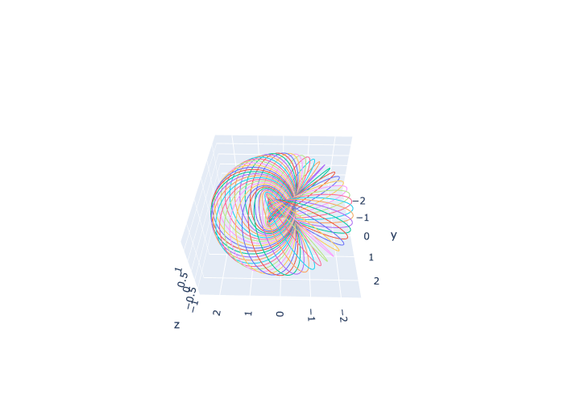

# build-a-universe

Let's build a universe, one step at a time!

### Hopf Fibration

Hopf fibration is a mathematical concept in the field of algebraic topology, discovered by Heinz Hopf in 1931. It is a mapping that shows a particular way to decompose the three-dimensional sphere (S^3) into a continuous family of circles. In other words, it is a way to represent a 3-sphere as a collection of circles arranged in a particular pattern.

The Hopf fibration is not only a mathematical curiosity but also has applications and connections to various fields such as physics, geometry, and even the study of the universe. For example, it is related to the structure of certain quantum states in quantum mechanics, and the study of black holes in general relativity.

Mathematically, the Hopf fibration is a map (fibration) from the 3-sphere S^3 (a 3-dimensional sphere in 4-dimensional space) to the 2-sphere S^2, with each point on the 2-sphere corresponding to a circle in the 3-sphere. The circles are called "fibers" and form a continuous family that fills the 3-sphere.

The Hopf fibration is fascinating because it demonstrates a nontrivial way of decomposing a high-dimensional sphere into lower-dimensional objects (circles in this case) while preserving some of its topological properties. It is an essential example of a fiber bundle, a more general concept in algebraic topology.

